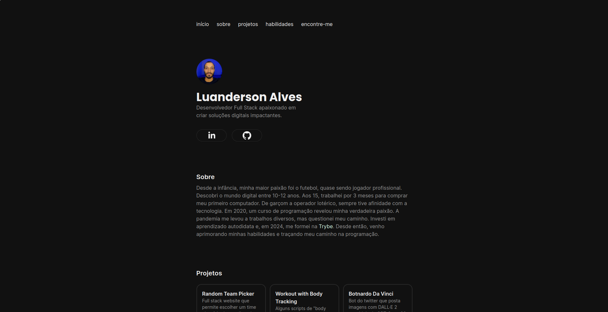

># Portfólio

### [Acesse aqui!](https://luandersonalvesdev.github.io/portfolio)

### Sobre o projeto
Criei o portfólio no propósito de ter uma página específica para compartilhar os meus projetos, redes e afins.

### Estilização
O minimalismo é mais do que uma preferência estética para mim; é uma abordagem que busco incorporar em todos os meus projetos. Acredito que a simplicidade pode potencializar a comunicação e a usabilidade, proporcionando uma experiência mais intuitiva para os usuários.

### Tecnologias Usadas 
- Vite
- React
- Tailwind CSS
- GH Pages
- JavaScript